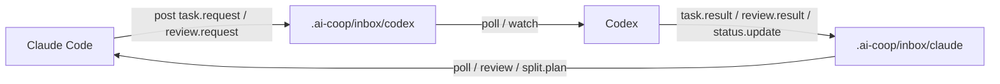

# Claude Code × Codex 双向协作协议

> 让 **Claude Code 负责规划、拆需求、做审查**，让 **Codex 负责执行、改 bug、跑验证、做落地**。  
> 两个代理在**同一个工作区**里通过文件化协议双向通信，**无需服务器、无需数据库、无需守护进程**。

一个面向真实开发工作的轻量协作协议：把 Claude Code 和 Codex 放进同一工作会话中，让它们围绕同一份代码、同一套消息、同一套验收标准协同工作。

---

## 为什么这个项目有价值

如果你已经习惯在 **Codex 内置终端**里打开 **Claude CLI**，那么最自然的协作方式不是再引入一个复杂平台，而是让两个 AI 直接共享工作区：

- **Claude 负责产出明确要求**：任务、提示词、步骤、验收标准、涉及文件
- **Codex 负责具体执行**：编码、修 bug、跑测试、补文档、处理阻塞
- **双方都能审查对方结果**：Claude 发起 review，Codex 返回 review result
- **任务可以自然拆分**：大任务拆成子任务，逐个收敛
- **状态可追踪**：所有消息都落在工作区文件里，随时可审计、可恢复

---

## 核心卖点

| 卖点 | 说明 |
| --- | --- |
| **双向通信** | Claude 和 Codex 可以互相发消息、回消息、推进任务 |
| **交叉审查** | 一个负责实现，一个负责审查，结果可反复迭代 |
| **任务拆分** | 支持把复杂需求拆成多个可执行子任务 |
| **文件化协议** | 消息存储在 `.ai-coop/` 中，结构清晰，便于追踪 |
| **部署简单** | 只依赖 Node.js 和工作区文件，不需要额外服务 |
| **GitHub 友好** | CLI-first，适合直接开源、fork、二次定制 |

---

## 工作方式



### 典型协作循环

1. **Claude 写清楚需求**
   - 新任务是什么
   - 需要改哪些文件
   - 预期步骤是什么
   - 验收标准是什么

2. **Codex 执行并回传结果**
   - 修改代码
   - 跑测试或项目命令
   - 记录 blockers
   - 给出可验证的结果

3. **Claude 审查并继续拆分**
   - 是否满足验收标准
   - 是否需要补边界条件
   - 是否需要继续拆任务

4. **循环直到完成**

---

## 推荐形态：Skill + CLI，而不是先做 Plugin

这个仓库的最佳发布方式是：

- **首选：Skill + CLI**
  - 最轻量
  - 最容易部署
  - 最适合 GitHub 开源
  - 对“Claude 在 Codex 终端里跑”这个场景最贴合

- **可选：Plugin**
  - 适合更深度的 Codex UI 集成
  - 但分发和维护成本更高
  - 不适合作为第一版的默认方案

**结论：先把它做成一个通用、可复用、可直接开箱使用的协作协议。**

---

## 安装

```bash
npm install
npm run coop:init
```

> 运行时只需要 Node.js 18.17+。  
> 如果你要从 GitHub 克隆、提交、推送，当然还需要本地安装 Git。

---

## 快速开始

### 1) 初始化工作区

```bash
npm run coop:init
```

这会创建 `.ai-coop/` 目录结构和模板文件。

### 2) Claude 给 Codex 发一个任务

```bash
npx codex2claude post \
  --from claude \
  --to codex \
  --kind task.request \
  --title "实现登录接口" \
  --body "新增 /api/login，支持邮箱 + 密码验证，并返回 token。" \
  --steps "先阅读现有 auth 模块|实现接口|补测试|本地验证" \
  --acceptance "成功返回 token|失败返回 401|测试通过" \
  --files "src/auth.js|src/routes/login.js|tests/auth.test.js" \
  --commands "npm test"
```

### 3) Codex 轮询消息并执行

```bash
npm run coop:poll:codex
```

或者持续轮询：

```bash
npm run coop:watch:codex
```

### 4) Codex 回传完成结果

```bash
npx codex2claude done \
  --agent codex \
  --id <message-id> \
  --summary "已实现并验证" \
  --body "补充了输入校验、token 生成、错误处理和测试。" \
  --files "src/auth.js|src/routes/login.js|tests/auth.test.js" \
  --commands "npm test"
```

---

## 命令

| 命令 | 作用 |
| --- | --- |
| `init` | 创建 `.ai-coop` 目录结构和模板 |
| `post` | 向另一个 agent 的收件箱写入结构化消息 |
| `poll` | 读取某个 agent 的待处理消息 |
| `watch` | 按固定间隔持续轮询 |
| `done` | 归档已处理任务并生成回复 |

常用脚本也已经预置：

```bash
npm run coop:init
npm run coop:poll:codex
npm run coop:poll:claude
npm run coop:watch:codex
npm run coop:watch:claude
```

---

## 消息类型

- `task.request`：Claude 分配给 Codex 的执行任务
- `task.result`：Codex 回传实现结果
- `review.request`：Claude 发起代码审查或修订请求
- `review.result`：Codex 返回审查结果或修复建议
- `split.plan`：Claude 把大任务拆成多个子任务
- `status.update`：任意一方同步状态、阻塞或进度

### 建议的消息内容

为了让协作更稳定，建议 Claude 在任务里写清楚：

- **任务目标**：要解决什么问题
- **步骤**：先做什么、后做什么
- **涉及文件**：预期修改哪些文件
- **验收标准**：如何判断完成
- **验证命令**：要跑哪些命令
- **阻塞条件**：如果卡住，应该返回什么

---

## 协议目录

```text
.ai-coop/
  inbox/
    claude/
    codex/
  archive/
    claude/
    codex/
  state/
    seen/
  templates/
    task-request.md
    review-feedback.md
```

所有消息都以文件形式保存在工作区里：

- 可审计
- 可追踪
- 可恢复
- 可直接纳入 Git 历史

---

## 提示词模板

`prompts/` 目录里提供了开箱模板：

- `prompts/claude-bootstrap.md`：给 Claude 的启动模板
- `prompts/codex-bootstrap.md`：给 Codex 的启动模板
- `prompts/review-template.md`：给审查流程的模板

如果你希望 Claude 只负责“规划 + 拆需求 + 出验收标准”，可以直接使用这些模板作为起点。

---

## 适合什么场景

- 在 Codex 里打开 Claude CLI 并长期协作
- Claude 负责拆需求，Codex 负责写代码
- 需要让 AI 之间有明确任务边界和验收标准
- 想把 AI 协作流程沉淀成可复用协议
- 想在 GitHub 上发布一个轻量、通用、可 fork 的工作流项目

---

## 开发与验证

```bash
npm test
node src/cli.js --help
node src/cli.js --version
npm pack --dry-run
```

---

## 发布到 GitHub

1. 确认本地安装 Git
2. 初始化仓库并设置远端
3. 运行测试和打包检查
4. 提交变更并推送到 GitHub

> 本仓库已经按照“可直接开源”的方式组织：文档、脚本、协议、模板、测试都已放在同一个仓库里。

---

## 目录结构

```text
bin/            # CLI 入口
src/            # 核心实现
docs/           # 协议说明与发布文档
prompts/        # Claude / Codex 启动提示词
tests/          # 自动化测试
examples/       # 示例用法
SKILL.md        # 作为 Codex skill 的入口说明
```

---

## 开源许可

MIT
